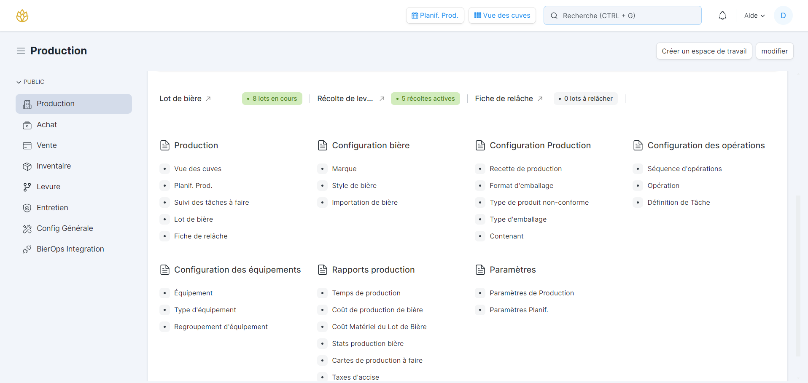

# Introduction

## Présentation
BierOps est un logiciel de gestion intégré (ERP) spécialement conçu pour répondre aux besoins uniques des microbrasseries. Ce système complet permet de gérer efficacement toutes les opérations d'une microbrasserie, depuis la production et la gestion des recettes, jusqu'à la distribution et la vente. Avec BierOps, les microbrasseries peuvent optimiser leurs processus, suivre les stocks en temps réel, et assurer la traçabilité des ingrédients, tout en respectant les réglementations en vigueur. Notre logiciel facilite la planification de la production et la gestion des commandes, offrant ainsi une solution tout-en-un pour améliorer la productivité et la rentabilité des brasseurs.

## Fonctionnalités

- **Inventaire en temps réel.** Consultez et planifiez votre inventaire.
- **Traçabilité.** Retracez les matières premières utilisées dans un lot spécifique.
- **Vue des cuves.** Consultez différents indicateurs de production en temps réel.
- **Planification de la production.** Prévoyez et ajustez votre production selon vos besoins.
- **Fiches de fermentation.** Facilitez l'enregistrement de vos lectures avec les fiches de fermentation.
- **Recettes de bières.** Chaque recette est suivie et respectée dans votre production de lot.
- **Tâches quotidiennes.** Planifiez facilement vos tâches de production.
- **Intégration machines.** Portrait global de votre production grâce à nos intégrations machines.
- **et plus encore...**

Pour de l'aide ou un aperçu des fonctionnalités offertes, naviguez dans les différentes sections de notre documentation.

:::info

Tous les urls utilisés dans cette documentation font référence à une version demo de BierOps. Afin d'utiliser les liens dans votre environnement BierOps, modifiez l'url pour celle de votre microbrasserie. P.ex. https://demo.bierops.com/app/stock-entry deviendra https://votremicro.bierops.com/app/stock-entry.

:::